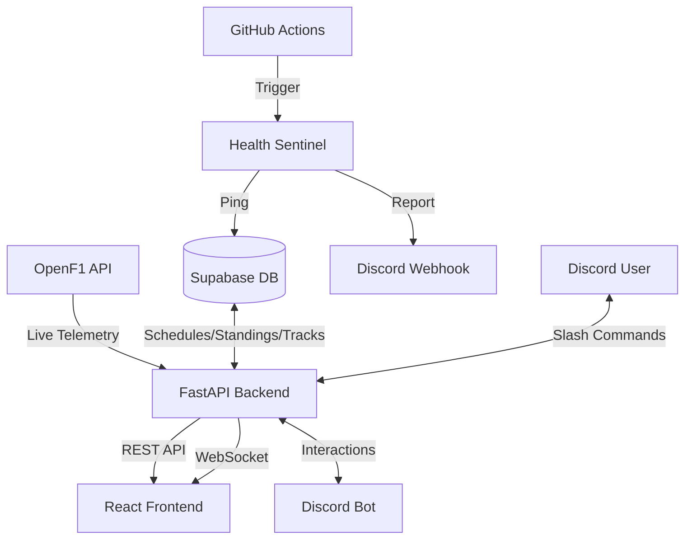

# SilverWall 🏎️

**Engineering-Grade F1 Telemetry Dashboard**

SilverWall is a fully **autonomous**, **database-driven** F1 telemetry dashboard. It transitions seamlessly between seasons, tracks, and off-seasons without any manual code updates, leveraging Supabase as its central nervous system and OpenF1 for live telemetry.


---

## ⚡ Autonomous Features

### 🧠 Year-Agnostic Intelligence
The backend dynamically identifies the "Active Season" based on Supabase data. As soon as you seed a new season, the entire app transitions—no code changes required.

### 🏁 Automated Data Lifecycle
- **Dynamic Results**: The `/api/results` endpoint is 100% database-driven—no more hardcoded placeholders.
- **Standings Sync**: Automated pipelines fetch official positions and update championship standings.
- **Track Learning**: Autonomously captures and saves new circuit geometry during live sessions.

### 💓 Sentinel Monitoring & Interaction
SilverWall features a dual-layer Discord integration:

1. **Automation (Webhooks)**: 
   - `silverwall_automation.yml` triggers every 3 days.
   - Posts a rich, automated report to your designated channel.
   - Includes health status, leaderboard, and next race countdown.

2. **Interaction (Slash Commands)**:
   - **`/status`**: Check system health & next race.
   - **`/standings [year]`**: Get live or historical championship standings.
   - **`/results`**: Get detailed podium results of the last completed race.
   - **`/champions`**: See world champions of the latest completed season.
   - **`/next`**: Get countdown and location for the upcoming Grand Prix.

---

## 📁 Project Structure

```
silverwall/
├── 📂 backend/                     # FastAPI Python Backend
│   ├── main.py                     # FastAPI app entry point with CORS
│   ├── database.py                 # Supabase client initialization
│   ├── models.py                   # Pydantic models for API responses
│   ├── requirements.txt            # Python dependencies
│   ├── vercel.json                 # Vercel serverless deployment config
│   ├── Procfile                    # Railway/Heroku deployment
│   │
│   ├── 📂 routes/                  # API Endpoint Handlers
│   │   ├── status.py               # /api/status - Race status & countdown
│   │   ├── standings.py            # /api/standings/* & /api/champions
│   │   ├── track.py                # /api/track/{circuit} - SVG geometry
│   │   ├── results.py              # /api/results & /api/season/races
│   │   ├── discord.py              # /api/discord/interactions - Bot handlers
│   │   ├── commentary.py           # /api/commentary - AI race commentary
│   │   └── radio.py                # /api/radio - Team radio messages
│   │
│   ├── 📂 migrations/              # Supabase SQL Migrations (Consolidated)
│   │   ├── 001_create_tables.sql   # Core schema (seasons, races, standings)
│   │   ├── 002_historical_2024.sql # Complete 2024 season data
│   │   ├── 003_historical_2025.sql # Complete 2025 season data
│   │   └── 004_seed_2026_season.sql # 2026 season opener kickoff
│   │
│   ├── 📂 pipeline/                # Automation Scripts
│   │   ├── seed_tracks.py          # Seed track geometry to Supabase
│   │   ├── ingest_results.py       # Fetch & store race results from OpenF1
│   │   ├── health_keepalive.py     # Supabase keepalive + Discord alerts
│   │   ├── register_commands.py    # Register Discord Slash Commands
│   │   └── fake_monza_timeline.py  # Test timeline generator
│   │
│   ├── 📂 websocket/               # WebSocket Handlers
│   │   └── telemetry_ws.py         # Real-time telemetry streaming
│   │
│   ├── openf1_fetcher.py           # OpenF1 API client
│   └── gemini_fetcher.py           # Gemini AI integration for commentary
│
├── 📂 Silverwall UIUX design system/  # React Frontend (Vite + TypeScript)
│   ├── index.html                  # HTML entry point
│   ├── vite.config.ts              # Vite configuration
│   ├── tailwind.config.js          # Tailwind CSS configuration
│   ├── package.json                # NPM dependencies
│   │
│   └── 📂 src/
│       ├── main.tsx                # React entry point
│       ├── App.tsx                 # Router configuration
│       │
│       ├── 📂 pages/               # Route Pages
│       │   ├── Landing.tsx         # Home page with race card & countdown
│       │   ├── TelemetryLive.tsx   # Live telemetry pit-wall dashboard
│       │   └── DesignSystem.tsx    # Component library showcase
│       │
│       ├── 📂 components/          # Reusable UI Components
│       │   ├── ResultsModal.tsx    # Season results modal (standings, races)
│       │   ├── CountdownOverlay.tsx # Race countdown overlay
│       │   ├── SeasonCountdown.tsx # Off-season countdown display
│       │   └── CommentaryPanel.tsx # AI-generated race commentary
│       │
│       ├── 📂 hooks/               # Custom React Hooks
│       │   ├── useRaceStatus.ts    # Fetches race status from /api/status
│       │   ├── useChampions.ts     # Fetches champions from /api/champions
│       │   ├── useStandings.ts     # Fetches standings from /api/standings
│       │   ├── useTrack.ts         # Fetches track SVG from /api/track
│       │   └── useTelemetry.ts     # WebSocket telemetry hook
│       │
│       └── 📂 styles/              # Global Styles
│           └── index.css           # Tailwind imports & custom styles
│
├── 📂 .github/
│   └── 📂 workflows/
│       ├── deploy-pages.yml        # Frontend deployment
│       └── silverwall_automation.yml # Automated health check task
│
├── 📂 docs/                        # Documentation
│   ├── API.md                      # API endpoint documentation
│   └── ARCHITECTURE.md             # System architecture details
│
├── README.md                       # This file
├── CHANGELOG.md                    # Version history
├── DEPLOYMENT.md                   # Deployment instructions
├── Dockerfile                      # Container deployment
└── railway.json                    # Railway deployment config
```

---

## 🏗️ Architecture



---

## 🗄️ Database Schema

| Table | Description |
|-------|-------------|
| `seasons` | Year, champion driver/constructor |
| `races` | Race schedule (date, circuit, status) |
| `race_results` | P1-P10 results for each race |
| `driver_standings` | Points, wins, position per driver |
| `constructor_standings` | Team championship standings |
| `tracks` | Circuit geometry (SVG path data) |

---

## 🚀 Quick Start

### 1. Database Setup
SilverWall uses an idempotent **"Delete-then-Insert"** migration strategy. This means you can run these scripts multiple times to reset your data to a clean state without hitting unique constraint errors.

Run the migrations in the following order in your Supabase SQL Editor:
1.  **`001_create_tables.sql`**: Core schema (tables & constraints).
2.  **`002_historical_2024.sql`**: Full 2024 archive (Standings & Podium Results).
3.  **`003_historical_2025.sql`**: Full 2025 archive (Standings & Official Results).
4.  **`004_seed_2026_season.sql`**: 2026 Season Kickoff (Upcoming events).

### 2. Environment Variables
Create `backend/env/.env.supabase`:
```env
SUPABASE_URL=https://your-project.supabase.co
SUPABASE_SERVICE_KEY=your-service-role-key
DISCORD_WEBHOOK_URL=https://discord.com/api/webhooks/...
```

Create `Silverwall UIUX design system/.env`:
```env
VITE_API_URL=http://localhost:8000
```

### 3. Run Locally

**Backend:**
```bash
cd backend
pip install -r requirements.txt
python -m uvicorn main:app --reload --port 8000
```

**Frontend:**
```bash
cd "Silverwall UIUX design system"
npm install
npm run dev -- --port 3000
```

---

## 🔌 API Endpoints

| Endpoint | Method | Description |
|----------|--------|-------------|
| `/api/status` | GET | Race status, countdown, next event |
| `/api/champions` | GET | Current season champions |
| `/api/standings/drivers/{year}` | GET | Driver championship standings |
| `/api/standings/constructors/{year}` | GET | Constructor standings |
| `/api/season/races/{year}` | GET | Race schedule with podium results |
| `/api/track/{circuit}` | GET | Track SVG geometry |
| `/api/results` | GET | Latest race results |
| `/api/discord/interactions` | POST | Discord Bot slash command gateway |

---

## 🔐 GitHub Secrets

| Secret | Description |
|--------|-------------|
| `SUPABASE_URL` | Your Supabase Project API URL |
| `SUPABASE_SERVICE_KEY` | Service Role Key (write access) |
| `DISCORD_WEBHOOK_URL` | Discord health channel webhook |
| `DISCORD_APP_ID` | Discord Bot Application ID |
| `DISCORD_PUBLIC_KEY` | Discord Bot Public Key |
| `DISCORD_BOT_TOKEN` | Discord Bot Auth Token |

---

## 🚀 Deployment

| Platform | Config File |
|----------|-------------|
| **Vercel** | `backend/vercel.json` |
| **Railway** | `railway.json` |
| **Docker** | `Dockerfile` |

---

## 📅 Roadmap

- [x] Autonomous Season Transitions
- [x] Dynamic Track Map Learning
- [x] Automated Standings Ingestion
- [x] Off-Season Countdown Display
- [x] Two-Way Discord Interaction Engine
- [ ] AI-Powered Race Strategy Predictions
- [ ] Multi-Driver Multi-View Layout
- [ ] Lap Time Comparison Charts

---

## 🛠️ Tech Stack

| Layer | Technology |
|-------|------------|
| **Frontend** | React 18, TypeScript, Vite, Tailwind CSS |
| **Backend** | Python, FastAPI, Pydantic |
| **Database** | Supabase (PostgreSQL) |
| **Real-time** | WebSocket, OpenF1 API |
| **AI** | Google Gemini (Commentary) |
| **CI/CD** | GitHub Actions |

---

## 📄 License

MIT License | Built with passion for F1 Engineering.

---

<p align="center">
  <strong>🏎️ SilverWall</strong> — Where Data Meets the Track
</p>
