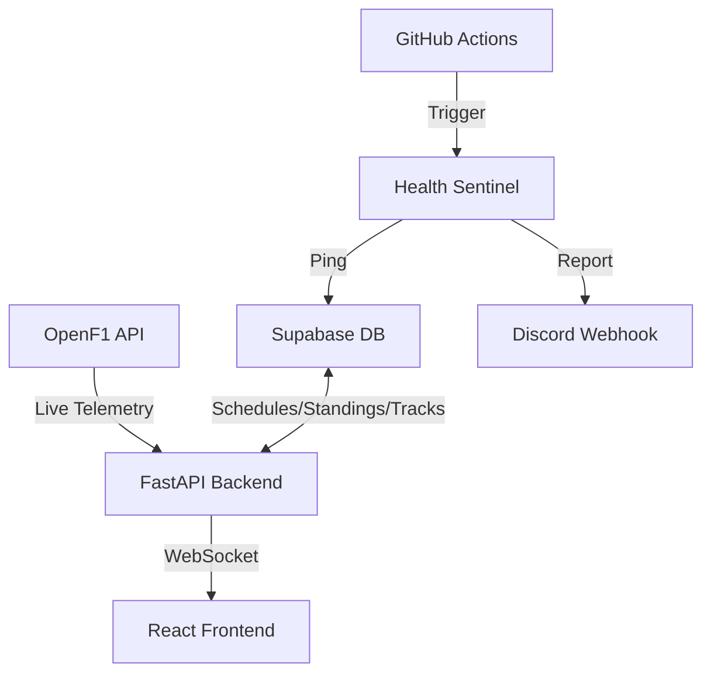

# SilverWall 🏎️

SilverWall is a fully **autonomous**, **database-driven** F1 telemetry dashboard. It transitions seamlessly between seasons, tracks, and off-seasons without any manual code updates, leveraging Supabase as its central nervous system and OpenF1 for live telemetry.


---

## ⚡ Autonomous Features

### 1. 🧠 Year-Agnostic Intelligence
The backend no longer relies on hardcoded years (2025, 2026, etc.). It dynamically queries Supabase to identify the "Active Season" based on your data. As soon as you seed a new season, the entire app transitions automatically.

### 2. 🗺️ Dynamic Track Learning
- **Zero-Blank Maps**: The app fetches geometry from the `tracks` table.
- **Self-Healing**: If a live session is active and the track geometry is missing or updated, the engine **autonomously captures and saves** the new map to Supabase for future use.

### 3. 🏁 Automated Results Ingestion
Built-in pipeline (`ingest_results.py`) to fetch official final positions from OpenF1 and update championship standings in Supabase with one click (or scheduled trigger).

### 4. 💓 Sentinel Monitoring
A dedicated "Keep-Alive" system (`health_keepalive.py`) ensuring your Supabase project never pauses.
- **GitHub Actions**: Runs every 72 hours automatically.
- **Discord Integration**: Sends real-time health reports and table status directly to your Discord.

---

## 🏗️ Architecture



---

## 🚀 Quick Start

### 1. Database Setup
1. Create a Supabase project.
2. Run the migration scripts in `backend/migrations/` in order.
3. Seed your initial tracks/seasons using `backend/pipeline/seed_tracks.py`.

### 2. Environment Variables
Created `.env.supabase` in `backend/env/`:
```env
SUPABASE_URL=your_project_url
SUPABASE_SERVICE_KEY=your_service_role_key
DISCORD_WEBHOOK_URL=your_discord_webhook
```

### 3. Running Locally
**Backend:**
```bash
cd backend
pip install -r requirements.txt
uvicorn main:app --reload
```

**Frontend:**
```bash
cd "Silverwall UIUX design system"
npm install
npm run dev
```

---

## 🔐 GitHub Secrets
To enable the automated health checks and production deployment, add these to your repository settings:

| Secret | Description |
|--------|-------------|
| `SUPABASE_URL` | Your Supabase Project API URL |
| `SUPABASE_SERVICE_KEY` | Your **Service Role** Key (needed for write access) |
| `DISCORD_WEBHOOK_URL` | The URL for your Discord health channel |

---

## 🚀 Deployment
- **Backend**: Native support for **Vercel Serverless Functions** via `vercel.json`.
- **Frontend**: Optimized for **Vercel** or **Netlify**.

---

## 📅 Roadmap
- [x] Autonomous Season Transitions
- [x] Dynamic Track Map Learning
- [x] Automated Standings Ingestion
- [ ] AI-Powered Race Strategy Predictions
- [ ] Multi-Driver Multi-View Layout

---

## 📄 License
MIT | Built with passion for F1 Engineering.
