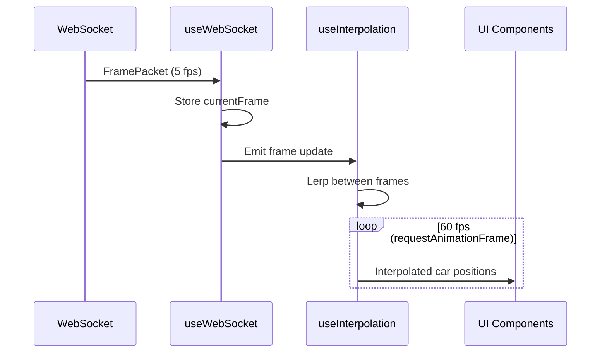

# SilverWall F1 Telemetry System Architecture

> **Mercedes-AMG Petronas Pit Wall Engineering Interface**  
> Surgical precision telemetry replay system for Formula 1 data analysis

---

## System Overview

SilverWall is a full-stack F1 telemetry replay system that transforms historical OpenF1 API data into a real-time pit wall experience. The architecture emphasizes **unidirectional data flow**, **frame-perfect interpolation**, and **surgical engineering aesthetics**.

### Technology Stack

| Layer | Technology |
|-------|-----------|
| **Backend** | Python, FastAPI, WebSockets, Pydantic |
| **Frontend** | React, TypeScript, Vite, Tailwind CSS |
| **Data Source** | OpenF1 API (historical session data) |
| **Protocol** | WebSocket streaming (JSON frames) |

---

## High-Level Architecture

```mermaid
graph TD
    A[OpenF1 API] -->|Raw Session Data| B(pipeline/fetch_openf1.py)
    B -->|JSON| C(pipeline/build_timeline.py)
    C -->|FFill + Normalization| D[TIMELINE In-Memory Store]
    D -->|Frame Query| E[FastAPI WebSocket /ws/monza]
    
    subgraph Frontend [React Client]
        E -->|JSON Frames| F[useWebSocket Hook]
        F -->|Frame Buffer| G[State Manager]
        G -->|Lerp / Interpolation| H[TrackCanvas SVG]
        G -->|Data Props| I[Leaderboard / DriverPanel / TelemetryBars]
    end
    
    style A fill:#1a1d23,stroke:#00D2BE,stroke-width:2px
    style D fill:#1a1d23,stroke:#00D2BE,stroke-width:2px
    style E fill:#1a1d23,stroke:#00D2BE,stroke-width:2px
    style Frontend fill:#050608,stroke:#00D2BE,stroke-width:3px
```



### Data Flow Principles

1. **Pipeline Stage**: OpenF1 → Normalize → TIMELINE (fixed 0.2s intervals)
2. **Streaming Stage**: TIMELINE → WebSocket → React (5 fps server, 60 fps client)
3. **Rendering Stage**: Frame Buffer → Interpolation → SVG Canvas

---

## Component Architecture

```mermaid
graph LR
    subgraph Backend
        A[FastAPI App] --> B[WebSocket /ws/monza]
        B --> C[TIMELINE Store]
        C --> D[FramePacket Stream]
    end
    
    subgraph Frontend Hooks
        D --> E[useWebSocket]
        E --> F[useInterpolation]
    end
    
    subgraph UI Components
        F --> G[TrackCanvas]
        F --> H[Leaderboard]
        F --> I[DriverPanel]
        F --> J[TelemetryBars]
        F --> K[ReplayControls]
    end
    
    style A fill:#121418,stroke:#00D2BE
    style E fill:#121418,stroke:#00D2BE
    style F fill:#121418,stroke:#00D2BE
    style G fill:#050608,stroke:#00D2BE,stroke-width:2px
    style H fill:#050608,stroke:#00D2BE,stroke-width:2px
    style I fill:#050608,stroke:#00D2BE,stroke-width:2px
    style J fill:#050608,stroke:#00D2BE,stroke-width:2px
    style K fill:#050608,stroke:#00D2BE,stroke-width:2px
```



---

## Backend Architecture

### File Structure

```
backend/
├── main.py                      # FastAPI app entry point
├── ws.py                        # WebSocket endpoint + replay logic
├── models.py                    # Pydantic data models
└── pipeline/
    ├── __init__.py
    ├── fetch_openf1.py          # OpenF1 API client
    ├── build_timeline.py        # Timeline normalization engine
    └── fake_monza_timeline.py   # Offline dev mock data
```

### Core Data Models

```python
from pydantic import BaseModel
from typing import List

class CarData(BaseModel):
    """Single car telemetry snapshot"""
    num: int              # Car number (e.g., 44)
    code: str             # Driver trigram (e.g., "HAM")
    team: str             # Team name (e.g., "Mercedes")
    x: float              # Normalized track X (0.0–1.0)
    y: float              # Normalized track Y (0.0–1.0)
    speed: int            # Speed in km/h
    gear: int             # Current gear (1-8)
    drs: bool             # DRS active flag
    throttle: int         # Throttle % (0–100)
    brake: int            # Brake % (0–100)

class FramePacket(BaseModel):
    """Complete telemetry frame for all cars"""
    t: float              # Absolute session time (seconds)
    cars: List[CarData]   # All active cars in this frame
```

### WebSocket Protocol

The `/ws/monza` endpoint supports three commands:

| Command | Payload | Effect |
|---------|---------|--------|
| `play` | `{ "cmd": "play", "speed": 1.0 }` | Resume playback at specified speed |
| `pause` | `{ "cmd": "pause" }` | Pause playback |
| `seek` | `{ "cmd": "seek", "time": 120.0 }` | Jump to specific session time |

**Frame Rate**: Server streams at **5 fps** (0.2s intervals), client interpolates to **60 fps**.

### Timeline Construction

The `build_timeline.py` module performs critical data normalization:

1. **Master Clock**: Create fixed-interval time array (0.0s → max_t, step 0.2s)
2. **Gap Filling**: Forward-fill (ffill) last known telemetry for each driver
3. **Frame Assembly**: For each tick, bundle all cars into a `FramePacket`

**Result**: Gapless, synchronized timeline ready for replay.

---

## Frontend Architecture

### File Structure

```
frontend/src/
├── App.tsx                      # Main layout orchestration
├── components/
│   ├── TrackCanvas.tsx          # SVG track + car rendering
│   ├── CarDot.tsx               # Individual car dot component
│   ├── Leaderboard.tsx          # Left panel: position table
│   ├── DriverPanel.tsx          # Right panel: selected driver details
│   ├── TelemetryBars.tsx        # Bottom panel: throttle/brake bars
│   └── ReplayControls.tsx       # Playback controls (play/pause/seek)
└── hooks/
    ├── useWebSocket.ts          # WebSocket connection manager
    └── useInterpolation.ts      # 60fps interpolation engine
```

### State Flow



### Key Hooks

#### `useWebSocket.ts`

**Responsibilities**:
- Establish WebSocket connection to `/ws/monza`
- Maintain connection state: `"connecting" | "open" | "closed" | "error"`
- Expose `currentFrame: FramePacket | null`
- Provide `sendCommand(cmd)` for playback control

#### `useInterpolation.ts`

**Responsibilities**:
- Buffer last two frames (`prev`, `next`)
- Run `requestAnimationFrame` loop
- Calculate `progress = (now - frameStartTime) / frameDuration`
- Lerp car positions: `x = prev.x + (next.x - prev.x) * progress`
- Return `renderCars: CarData[]` at 60fps

---

## UI Layout

```
┌─────────────────────────────────────────────────────────────┐
│  SILVERWALL | Monza GP | Lap 23/53 | 00:34:12      [Status] │
├─────────────┬───────────────────────────────────┬───────────┤
│             │                                   │           │
│ LEADERBOARD │         TRACK CANVAS              │  DRIVER   │
│             │                                   │  PANEL    │
│  P  NUM     │      ┌─────────────────┐          │           │
│  1  HAM     │      │   ╔═══════╗     │          │  #44 HAM  │
│  2  VER     │      │   ║ MONZA ║     │          │  Mercedes │
│  3  LEC     │      │   ╚═══════╝     │          │           │
│  4  SAI     │      │                 │          │  Speed    │
│  5  NOR     │      │   ●HAM  ●VER    │          │  312 km/h │
│             │      │                 │          │           │
│             │      └─────────────────┘          │  Gear: 7  │
│             │                                   │  DRS: ON  │
├─────────────┴───────────────────────────────────┴───────────┤
│  TELEMETRY BARS                                              │
│  HAM ████████████░░░░░░ 85%  ░░░░░░░░░░░░░░░░ 0%            │
│  VER ███████████░░░░░░░ 78%  ░░░░░░░░░░░░░░░░ 0%            │
├──────────────────────────────────────────────────────────────┤
│  ◄◄  ▶  ►►  [────●──────────] 34:12 / 1:24:35   Speed: 1.0x │
└──────────────────────────────────────────────────────────────┘
```

### Component Responsibilities

| Component | Purpose |
|-----------|---------|
| **TrackCanvas** | SVG viewBox rendering of Monza circuit + car dots |
| **CarDot** | Minimal dot with driver code, team color ring |
| **Leaderboard** | Live position table (P, NUM, CODE, GAP) |
| **DriverPanel** | Detailed telemetry for selected driver |
| **TelemetryBars** | Horizontal throttle/brake bars for all cars |
| **ReplayControls** | Play/pause/seek/speed controls |

---

## Design System: "Surgical Engineering"

### Design Philosophy

> **Mercedes-AMG Principle**: High information density, cold precision, zero playfulness.

- **NOT**: Gamer overlay, neon lights, gradients, glass effects
- **YES**: Matte carbon, surgical lines, technical readability, elite pit wall

### Color Tokens

| Token | Hex | Usage |
|-------|-----|-------|
| `surface-0` | `#050608` | Main background (matte carbon) |
| `surface-1` | `#121418` | Panel backgrounds |
| `border-subtle` | `#2A2E35` | Panel borders |
| `amg-teal` | `#00D2BE` | Primary highlight, active states, track outline |
| `text-high` | `#E0E0E0` | Primary values (92% opacity) |
| `text-mid` | `#9CA3AF` | Labels, secondary text (70% opacity) |
| `alert` | `#FF3B30` | Critical flags, warnings |
| `sector-purple` | `#D042FF` | Purple sector highlights |

### Typography

| Element | Font | Weight | Size | Transform |
|---------|------|--------|------|-----------|
| Headers | Inter | 600 | 14px | UPPERCASE, letter-spacing: 0.05em |
| Body | Inter | 400 | 13px | - |
| Numbers | JetBrains Mono | 500 | 16px | Tabular numerals |
| Labels | Inter | 500 | 11px | UPPERCASE, letter-spacing: 0.08em |

### Component Styling Rules

1. **Panels**: Flat `surface-1`, 1px `border-subtle`, no shadows
2. **Borders**: `rgba(0, 210, 190, 0.25)` for teal-tinted lines
3. **Animations**: Subtle fades (200ms ease), no bounce/overshoot
4. **Spacing**: 4px grid system (8px, 12px, 16px, 24px)
5. **Corners**: 8px border-radius for panels, 4px for buttons

---

## Integration Guide

### Plugging Real OpenF1 Data

1. **Fetch Session**:
   ```python
   sessions = fetch_sessions(year=2024)
   monza = [s for s in sessions if s['circuit_short_name'] == 'Monza'][0]
   ```

2. **Fetch Telemetry**:
   ```python
   for driver_num in [44, 1, 16, 55, ...]:
       car_data[driver_num] = fetch_car_data(monza['session_key'], driver_num)
   ```

3. **Build Timeline**:
   ```python
   TIMELINE = build_timeline(car_data)
   ```

4. **Start Server**:
   ```bash
   uvicorn main:app --reload
   ```

5. **Connect Frontend**:
   ```typescript
   const ws = new WebSocket('ws://localhost:8000/ws/monza');
   ```

### Development Workflow

| Step | Command |
|------|---------|
| Backend dev | `uvicorn main:app --reload` |
| Frontend dev | `npm run dev` |
| Build frontend | `npm run build` |
| Type check | `npm run type-check` |

---

## Performance Characteristics

| Metric | Target | Notes |
|--------|--------|-------|
| Server frame rate | 5 fps | 0.2s intervals, reduces bandwidth |
| Client render rate | 60 fps | Interpolated via `requestAnimationFrame` |
| WebSocket latency | <50ms | Local network assumption |
| Timeline memory | ~100MB | 1 hour race, 20 cars, 0.2s ticks |
| Frame payload size | ~2KB | JSON, 20 cars × 10 fields |

---

## Next Steps

1. **Backend**: Implement `build_timeline.py` with ffill logic
2. **Frontend**: Build `useInterpolation.ts` with lerp math
3. **UI**: Create `TrackCanvas.tsx` with Monza SVG path
4. **Testing**: Validate frame-perfect playback with mock data
5. **Polish**: Apply Mercedes-AMG design tokens across all components

---

**SilverWall** — *Precision telemetry for the pit wall.*
